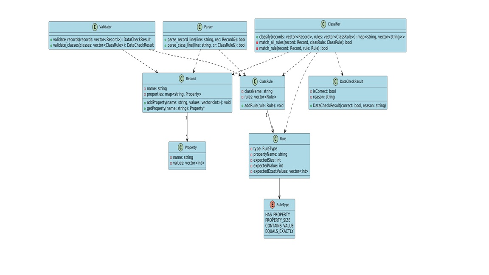
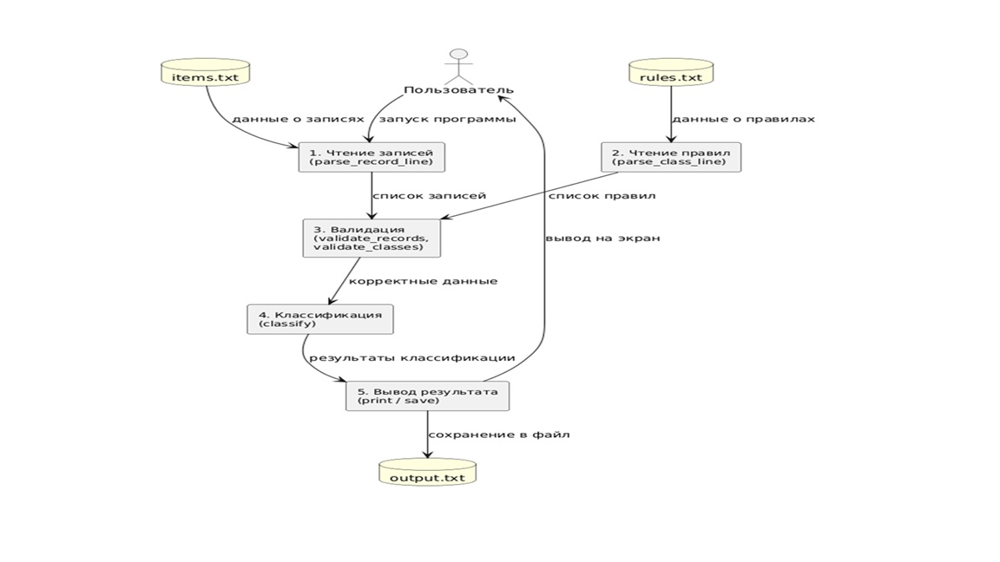

# RecordClassifier / Классификация записей по набору правил

**Студент / Student:** Алхабил Бахаа А.М.  
**Преподаватель / Supervisor:** доц. Сычев О.А.  
**Дисциплина / Course:** Качество и надёжность программного обеспечения  
**Университет / University:** Волгоградский государственный технический университет  
**Год / Year:** 2025  

---

## Назначение программы / Purpose

**RecordClassifier** — консольная программа, предназначенная для классификации записей на основе заданных правил.  
Программа анализирует файлы `items.txt` и `rules.txt`, проверяет их корректность, выполняет классификацию и формирует выходной файл `output.txt`.

**The RecordClassifier** program performs automatic classification of records based on a set of user-defined rules.  
It validates input files, parses structure, and outputs categorized results.

---

## Цели и задачи / Goals and Objectives

- Разработать систему чтения и синтаксического анализа входных данных.  
- Реализовать валидацию записей и правил.  
- Создать модуль классификации записей по признакам.  
- Реализовать устойчивую обработку ошибок.  
- Провести модульное тестирование и документирование (Doxygen, UML).

---

## Основные функции / Core Functions

| Функция / Function | Назначение / Description |
|--------------------|--------------------------|
| `parse_record_line` | Разбор строк с объектами и их свойствами |
| `parse_class_line` | Разбор строк с правилами классификации |
| `validate_records` | Проверка корректности записей |
| `validate_classes` | Проверка корректности правил |
| `classify` | Сопоставление записей и распределение по классам |
| `trim` | Удаление пробелов и табуляций |

---

## Формат входных и выходных файлов / Input & Output Format

### Входные данные / Input

**1. `items.txt`** — список записей в формате:

```
Car: color = [2], doors = [4], engine = [2000]
Bike: color = [3], wheels = [2]
Bus: color = [2,3], doors = [2], seats = [40]
```

**2. `rules.txt`** — список правил классификации:

```
Has doors: has property "doors"
Two wheels: property "wheels" contains value 2
Red vehicle: property "color" contains value 2
Big bus: property "seats" = [40]
```

### Выходные данные / Output

**`output.txt`:**

```
Has doors: Car, Bus
Two wheels: Bike
Red vehicle: Car, Bus
Big bus: Bus
```

---

## Структура данных / Data Structures

- **Property** — имя и список значений свойства (`string name; vector<int> values;`)  
- **Record** — имя записи и набор свойств (`map<string, Property> properties;`)  
- **Rule** — тип проверки (`RuleType`), имя свойства и ожидаемые значения  
- **ClassRule** — класс с набором правил  
- **DataCheckResult** — результат проверки корректности  

```cpp
enum RuleType {
    HAS_PROPERTY,
    PROPERTY_SIZE,
    CONTAINS_VALUE,
    EQUALS_EXACTLY
};
```

---

## UML-диаграмма классов / UML Class Diagram



---

## Диаграмма вызовов функций / Function Call Diagram


---

## Диаграмма потоков данных / Data Flow Diagram



---

## Методика испытаний / Testing Methodology

Программа прошла модульные тесты (unit tests) для всех ключевых функций:  
`parse_record_line`, `parse_class_line`, `validate_records`, `validate_classes`, `classify`.

### Пример теста / Example test case

| № | Ситуация / Case | Входные данные / Input | Ожидаемый результат / Expected Output |
|---|-----------------|------------------------|---------------------------------------|
| 1 | Корректная запись | `Car: color=[2], doors=[4]` | true — Record parsed successfully |
| 2 | Ошибка синтаксиса | `Table: color=[1, a, 3]` | false — Invalid numeric value |
| 3 | Пустое имя | `: color=[1]` | false — Empty record name |
| 4 | Некорректное правило | `Class: if "size" = number` | false — Unsupported rule type |

---

## Пример классификации / Example Classification

### Входные файлы:

**items.txt:**
```
Car: color = [2], doors = [4]
Bike: color = [3], wheels = [2]
```

**rules.txt:**
```
Has doors: has property "doors"
Blue: property "color" contains value 3
```

### Результат:

```
Has doors: Car
Blue: Bike
```

---

## Обработка ошибок / Error Handling

| Тип ошибки / Error Type | Пример | Сообщение / Message |
|-------------------------|--------|---------------------|
| Отсутствует файл | (missing file) | Cannot open the file |
| Некорректный формат значения | `color = [1, a, 3]` | Invalid value format |
| Дублирующееся свойство | `color=[1], color=[2]` | Duplicate property name |
| Пустое имя записи | `: color=[1]` | Empty record name |
| Ошибка синтаксиса | `color [1,2]` | Syntax error in record definition |
| Неизвестный тип правила | `property "speed" greater than 100` | Unsupported rule type |

---

## Алгоритм работы / Program Workflow

1. **Чтение данных** (`parse_record_line`, `parse_class_line`)
2. **Проверка корректности** (`validate_records`, `validate_classes`)
3. **Классификация** (`classify`)
4. **Вывод и сохранение результата** (`print_results`)

---

## Средства разработки / Environment

- **Язык / Language:** C++17
- **IDE:** Microsoft Visual Studio 2019
- **OS:** Windows 10
- **Документация / Docs:** Doxygen, PlantUML

---

## Структура проекта / Project Structure

```
FilteringRecords/
├── Header Files
│   ├── Classifier.h
│   ├── ClassRule.h
│   ├── DataCheckResult.h
│   ├── Error.h
│   ├── Matching.h
│   ├── Parser.h
│   ├── Property.h
│   ├── Record.h
│   ├── Rule.h
│   └── Validation.h
│
├── Source Files
│   ├── Classifier.cpp
│   ├── Error.cpp
│   ├── main.cpp
│   ├── Match.cpp
│   ├── Parser.cpp
│   ├── Record.cpp
│   └── Validation.cpp
│
├── images
│   ├── uml-class-diagram.png
│   ├── function-call-diagram.png
│   └── data-flow-diagram.png
│
├── Resource Files
│   (папка для дополнительных ресурсов — например, входных данных)
│
└── FilteringRecordsTests
    (модульные тесты для функций parse, validate, classify)
```

---

## Инструкция по запуску / Run Instructions

### Компиляция:

```bash
g++ -std=c++17 main.cpp Parser.cpp Validator.cpp Classifier.cpp -o RecordClassifier
```

### Запуск:

```bash
RecordClassifier.exe items.txt rules.txt output.txt
```

---

## Результаты тестирования / Test Summary

- **Всего тестов / Total tests:** 45
- **Пройдено успешно / Passed:** 45
- **Ошибок / Errors:** 0
- **Среда тестирования:** Windows 10, Visual Studio 2019
- **Тестовые файлы:** `items_test.txt`, `rules_test.txt`, `output_test.txt`

---

## Автор / Author

**Студент:** Алхабил Бахаа А.М.  
**Преподаватель:** доц. Сычев О.А.  
**Дисциплина:** Качество и надёжность программного обеспечения  
**Университет:** Волгоградский государственный технический университет  
**Год / Year:** 2025

---